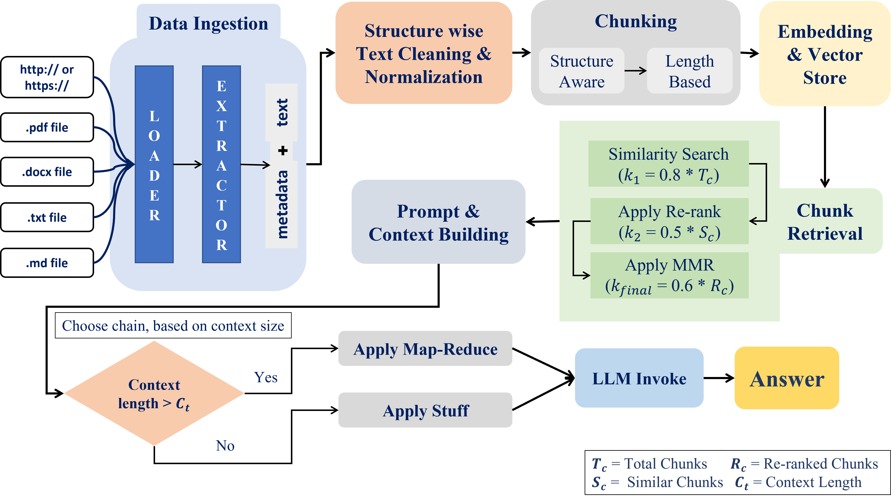

# 📚 Multi-Document RAG Pipeline

This project implements a **production-oriented Retrieval-Augmented Generation (RAG) system** that can answer questions over **multiple document types** such as PDFs, DOCX, TXT, Markdown files, and web URLs.

The system is designed to be:

* **Accurate** (grounded answers only)
* **Scalable** (handles long documents efficiently)
* **Modular** (each pipeline stage is clearly separated)
* **Deployable** (works locally and on Streamlit Cloud)

---

## 🔍 What Problem Does This Solve?

Large Language Models (LLMs) do not inherently know your private or domain-specific documents.

This RAG pipeline:

1. Ingests your documents
2. Converts them into searchable vectors
3. Retrieves the most relevant content for a query
4. Uses an LLM **only on retrieved context**
5. Produces grounded, reliable answers with sources

---

## 🧠 High-Level Architecture

The system consists of  **four major layers** :

1. **Data Ingestion & Preprocessing**
2. **Vector Indexing & Retrieval**
3. **Answer Generation (Stuff / Map-Reduce)**
4. **User Interface (Streamlit with Embedded Backend)**

---

## 🔁 RAG Pipeline Flowchart

Below is the conceptual flow of the RAG pipeline used in this project.

### Flow Description

1. User uploads documents or provides URLs
2. Documents are cleaned, normalized, and chunked
3. Chunks are embedded and stored in FAISS
4. User asks a question
5. Relevant chunks are retrieved, reranked, and diversified
6. Answer is generated using Stuff or Map-Reduce
7. Final answer and sources are returned

---

## 🧩 Pipeline Stages Explained

### 1️⃣ Data Ingestion

Supported inputs:

* PDF
* DOCX / DOC
* TXT
* Markdown
* Web URLs

Each document is extracted into raw text along with metadata such as:

* source path
* document type
* page or section info

---

### 2️⃣ Cleaning & Normalization

This stage ensures the text is  **LLM-friendly and consistent** .

**Structured Cleaning (type-specific):**

* Markdown: remove formatting symbols
* Web pages: strip HTML, scripts, styles
* PDFs/DOCX: remove page artifacts, broken spacing

**Normalization (general):**

* whitespace normalization
* newline cleanup
* Unicode normalization
* consistent paragraph formatting

---

### 3️⃣ Chunking Strategy

Documents are split into chunks based on  **document length** , not file type.

* Small documents → larger chunks
* Large documents → smaller chunks with overlap

This balances:

* retrieval accuracy
* LLM context limits
* processing speed

---

### 4️⃣ Embeddings & Vector Store

* **Embedding model:** Google DeepMind's Gemma 3 architecture based

  (e.g. `embeddinggemma`)
* **Vector store:** FAISS

Each chunk is embedded and stored for fast similarity search.

---

### 5️⃣ Retrieval Pipeline

The retrieval stage follows a  **dynamic strategy** :

1. Vector similarity search
2. Cross-encoder reranking
3. MMR (Maximal Marginal Relevance) for diversity
4. Final selection

This ensures:

* high relevance
* low redundancy
* good coverage of the topic

---

## 🧠 Answer Generation Strategies

The system dynamically chooses between two strategies.

---

### 🟢 Stuff Strategy (Small Context)

Used when:

* few chunks are retrieved
* total context is small

**Process:**

* All chunks are combined into one context
* Single LLM call
* Direct, concise answer

**Benefits:**

* Fast
* Simple
* Low cost

---

### 🔵 Map-Reduce Strategy (Large Context)

Used when:

* many chunks are retrieved
* document is long or complex

#### Map Phase

* Each chunk is processed **independently**
* Relevant facts are extracted
* Partial relevance is preserved

#### Reduce Phase

* All map outputs are combined
* Duplicates are removed
* Final grounded answer is synthesized

**Benefits:**

* Scales to large documents
* Better factual accuracy
* Reduced hallucination

---

## 🧠 Prompting Design

The system uses  **three carefully designed prompts** :

* **System Prompt:** Enforces grounding and behavior
* **Map Prompt:** Extracts relevant facts per chunk
* **Reduce Prompt:** Synthesizes a final answer
* **Stuff Prompt:** Direct QA for small contexts

All prompts are:

* strict about context usage
* anti-hallucination
* concise and deterministic

---

## 🤖 LLM & Model Choices

### LLM (Answer Generation)

* **OlIama Models**
  * LLama 3.2
  * embeddinggemma
* Chosen for:
  * high speed
  * free access

### Embeddings

* Ollama Embeddings
* Local inference (no API cost)

### Reranking

* Cross-Encoder (`ms-marco-MiniLM-L-6-v2`)
* Improves semantic precision

---

## 🖥️ User Interface

* Built using **Streamlit**
* Backend logic is **embedded**
* Works on:
  * local machine
  * Streamlit Cloud

**User flow:**

1. Upload documents
2. Index documents
3. Ask a question
4. View answer + sources
5. Clear context if needed

---

## 🚀 Deployment Notes

* Ollama is used **only locally**
* Cloud deployment uses:
  * Groq for LLM
  * HuggingFace embeddings
* Secrets managed via Streamlit Cloud settings

---

## ✅ Key Design Decisions

* No hallucinated answers
* Chunk-aware retrieval
* Balanced speed vs accuracy
* Simple deployment
* Modular and extensible codebase

---

## 📌 Future Improvements

* Query-aware retrieval tuning
* Answer confidence scoring
* Multi-turn conversational memory
* Citation scoring and highlighting
* Evaluation metrics (faithfulness, recall)

---

## 🏁 Summary

This project demonstrates a **real-world, production-ready RAG pipeline** that balances:

* correctness
* performance
* simplicity
* scalability

It is suitable for:

* document Q&A systems
* internal knowledge bases
* research assistants
* enterprise document search
